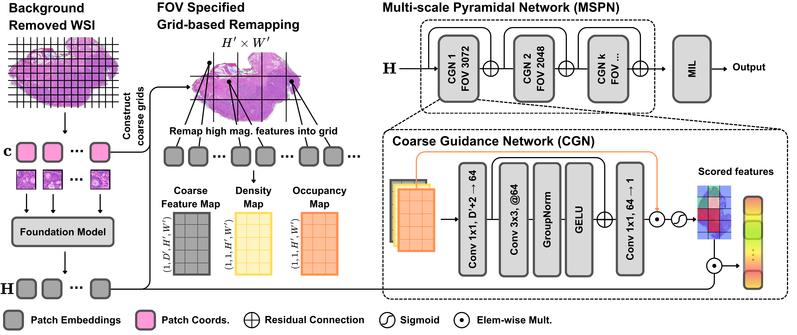

# Multi-scale Pyramidal Network

**MSPN** — a lightweight, generalisable module for
attention-based MIL that introduces progressive multi-scale analysis over whole
slide images.



___

## Environment

Developed with `torch 2.2.0` / `CUDA 12.3` on Ubuntu 22.04. Any environment
that can run an MIL pipeline should work.

## 1. Preprocessing

Patching is done with the [CLAM](https://github.com/mahmoodlab/CLAM) toolkit.
Patches at each magnification are tiled to 256x256 and saved for feature
extraction.

## 2. Feature extraction

```bash
python generate_features.py --backbone [conch, uni2, gigapath] --src PATCH_DIR --save_dir FEAT_DIR
```

## 3. Training

5-fold cross-validation happens inside a single invocation: the script iterates
over every split file in `--split_dir`.

| Script | Task | Input |
|---|---|---|
| `main.py` / `main_surv.py` | classification / survival | single magnification (`--data_dir`) |
| `main_ms.py` / `main_surv_ms.py` | multi-scale baselines | 5x/10x/20x (`--data_bb`) |

The single-magnification scripts take `--data_dir` directly. The two
multi-scale scripts instead compose their three paths per task, so set
`DATA_ROOT` at the top of `main_ms.py` / `main_surv_ms.py` and lay the features
out as

```
<DATA_ROOT>/<backbone>_feats/5x/*.h5
<DATA_ROOT>/<backbone>_feats/10x/*.h5
<DATA_ROOT>/<backbone>_feats/20x/*.h5
```

where `<backbone>` is whatever you pass to `--data_bb`. One cohort per
`DATA_ROOT`. Every path argument ships with the placeholder default
`your data path`, so a run that forgets one fails immediately rather than
reading the wrong cohort.

```bash
python main.py --arch abmil_mspn --use_coords \
    --ann ANNOTATION_CSV --split_dir SPLIT_DIR --data_dir FEAT_DIR \
    --res_root RES_DIR --task TASK --n_classes 2 --in_dim 512 \
    --lr 2e-4 --gc 32 --epochs 150 --scheduler CALR --early_stopping
```

### Architectures

| `--arch` | |
|---|---|
| `abmil_mspn`, `dsmil_mspn`, `clamsb_mspn`, `clammb_mspn` | **MSPN**, on each of the four MIL heads |
| `abmil`, `dsmil`, `clamsb`, `clammb` | the MIL heads MSPN wraps, run alone |
| `transmil`, `camil`, `patchgcn`, `h2mil`, `smmil`, `hipt` | published single-scale baselines |
| `hagmil`, `zoommil` | published multi-scale baselines (`main_ms.py`) |
| `maxpool`, `meanpool` | pooling floor |
| `abmilms`, `dsmilms`, `clamsbms`, `clammbms` | multi-scale, cross-scale attention (`main_ms.py`) |
| `abmilmscat`, `dsmilmscat`, `clamsbmscat`, `clammbmscat` | multi-scale, concatenation (`main_ms.py`) |

### Important arguments

- **`--use_coords`** makes the dataset return `(features, coords)`
- **`--fov`** sets MSPN's fields of view in slide pixels. Under highest resolution of 20x magnification:

  | `--fov` | 1024 | 1536 | 2048 | 2560 | 3072 |
  |---|---|---|---|---|---|
  | magnification | 10x | 6.67x | 5x | 4x | 3.33x |

  The default, `3072, 2048, 1024`, is the configuration reported in the paper.

