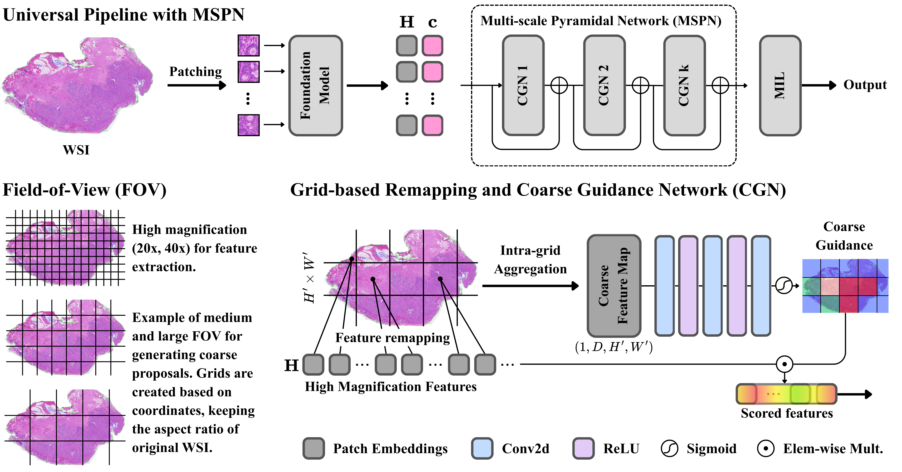

# MSPN

**Multi-scale Pyramidal Network** — a lightweight, plug-and-play module for
attention-based MIL that introduces progressive multi-scale analysis over whole
slide images.



MSPN sits between a frozen patch encoder and a standard MIL head. For each
field of view it bins patches into a lattice, mean-pools each cell, scores the
cell with a small convolution, scatters that score back to the patches, and
applies it as a gated residual `h ← h + h·σ(score)`. Scales are processed
coarse → fine and each scale pools the tensor the previous ones already
modulated, so guidance accumulates down the pyramid.

The coarse views are **pooled from the 20× features the MIL head already
consumes**, so MSPN needs only a single magnification on disk — no 5×/10×/20×
triplet, and no re-tiling.

___

## Environment

Developed with `torch 2.2.0` / `CUDA 12.3` on Ubuntu 22.04. Any environment
that can run an MIL pipeline should work. Core dependencies: `torch`,
`h5py`, `pandas`, `numpy`, `scikit-learn`, `scikit-survival`, `einops`,
`nystrom-attention`, `matplotlib`, `tqdm`.

Two notes:

- **NumPy < 2.3** is required for the survival entry points. `utils/surv_utils.py`
  assigns a shape-`(1,)` array into a scalar slot, which NumPy 2.4 rejects
  (`ValueError: setting an array element with a sequence`).
- The `abmilpre*` architectures load a pretrained MIL body from
  [MIL-Lab](https://github.com/mahmoodlab/MIL-Lab); install it only if you want
  those arms. Nothing else imports it.

## 1. Preprocessing

Patching is done with the [CLAM](https://github.com/mahmoodlab/CLAM) toolkit.
Patches at each magnification are tiled to 256×256 and saved for feature
extraction.

## 2. Feature extraction

A HuggingFace token is required for CONCH, UNI2 and GigaPath (set it in
`preprocessing/generate_features.py`).

```bash
python generate_features.py --backbone [conch, uni2, gigapath] \
    --src PATCH_DIR --save_dir FEAT_DIR
```

This writes one `.h5` per slide holding a `features` and a `coords` dataset.
`coords` are patch positions in slide pixels, and MSPN needs them.

## 3. Training

5-fold cross-validation happens inside a single invocation: the script iterates
over every split file in `--split_dir`.

| script | task | input |
|---|---|---|
| `main.py` / `main_surv.py` | classification / survival | single magnification (`--data_dir`) |
| `main_ms.py` / `main_surv_ms.py` | multi-scale baselines | 5×/10×/20× triplet (`--data_bb`) |
| `main_pre.py` / `main_pre_surv.py` | pretrained MIL bodies | single magnification |

The single-magnification scripts take `--data_dir` directly. The two
multi-scale scripts instead compose their three paths per task, so set
`DATA_ROOT` at the top of `main_ms.py` / `main_surv_ms.py` and lay the features
out as

```
<DATA_ROOT>/<backbone>_feats/5x/*.h5
<DATA_ROOT>/<backbone>_feats/10x/*.h5
<DATA_ROOT>/<backbone>_feats/20x/*.h5
```

where `<backbone>` is whatever you pass to `--data_bb`. One cohort per
`DATA_ROOT`. Every path argument ships with the placeholder default
`your data path`, so a run that forgets one fails immediately rather than
reading the wrong cohort.

```bash
python main.py --arch abmil_mspn --pos_enc \
    --ann ANNOTATION_CSV --split_dir SPLIT_DIR --data_dir FEAT_DIR \
    --res_root RES_DIR --task TASK --n_classes 2 --in_dim 512 \
    --lr 2e-4 --gc 32 --epochs 150 --scheduler CALR --early_stopping
```

### Architectures

| `--arch` | |
|---|---|
| `abmil_mspn`, `dsmil_mspn`, `clamsb_mspn`, `clammb_mspn` | **MSPN**, on each of the four MIL heads |
| `abmil`, `dsmil`, `clamsb`, `clammb`, `transmil` | single-scale baselines |
| `maxpool`, `meanpool` | pooling floor |
| `abmilms`, `dsmilms`, `clamsbms`, `clammbms` | multi-scale, cross-scale attention (`main_ms.py`) |
| `abmilmscat`, `dsmilmscat`, `clamsbmscat`, `clammbmscat` | multi-scale, concatenation (`main_ms.py`) |
| `abmilpre`, `abmilpre_mspn` | pretrained MIL body (`main_pre.py`) |

### Flags that matter

- **`--pos_enc` is mandatory for every `*_mspn` arch.** It is what makes the
  dataset return `(features, coords)`; without coordinates MSPN cannot build
  its lattice, and the arch dispatch falls through to `NotImplementedError`.
- **`--fov`** sets MSPN's fields of view in slide pixels. A 20× tile spans 512
  units, so magnification is `20 × 512 / fov`:

  | `--fov` | 1024 | 1536 | 2048 | 2560 | 3072 |
  |---|---|---|---|---|---|
  | magnification | 10× | 6.67× | 5× | 4× | 3.33× |

  The default, `3072, 2048, 1024`, is the configuration reported in the paper.
  Note that 3.33× is not an acquirable objective magnification — it is a pooled
  footprint, which is the point.
- **`--in_dim` must match the encoder**: CONCH 512, UNI2 1536, GigaPath 1536,
  ResNet-50 1024.
- **`--batch_size` must stay 1.** Bags have variable length and the loops index
  a single slide at a time.
- **`--gc`** does double duty: gradient-accumulation steps, and the on/off
  switch for L1 regularisation (`gc > 1` enables it). Reported runs use `32`.
- A run **exits silently if its result directory already exists**, which is the
  intended re-run guard. Pass `--debug` to override.

### Results layout

```
RES_DIR/<arch>_<task>_b1_gc32_<opt>_e<epochs>_lr<lr>_<loss>_<scheduler>/
    auc_metrics.csv, f1_metrics.csv, roc_curves_*.png
    split_<i>/
        ckpt/best_val.pt
        train_details.csv, val_details.csv, test_details.csv
        split_auc_metrics.csv, split_f1_metrics.csv, split_ci_metrics.csv
        val/, test/           confusion matrices
```

Survival runs write `cindex_metrics.csv`, `split_cindex.csv` and
`surv_risk.csv` in place of the AUC files.
